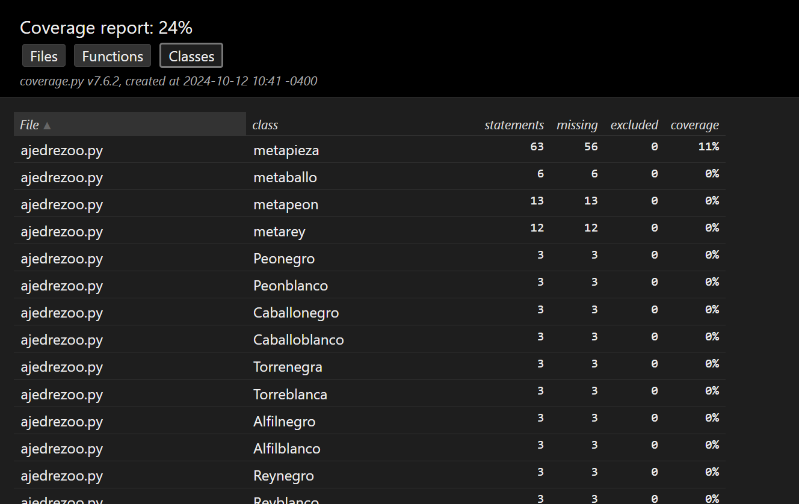

# HERRAMIENTA DE XUNIT- Pytest 

Pytest es una herramienta para test unitario, una de las más utilizadas por detrás de `unittest`. Es una herramienta muy potente para testing unitario, altamente customizable, y con muchos plugins con todo tipo de usos, además de features como fixtures, o el archivo `conftest`, que nos permite hacer un setup global para tu suite de testing.

### Pros:
- **Sintaxis más sencilla y legible**: Pytest utiliza una sintaxis más simple y fácil de leer que Unittest. No es necesario escribir clases y métodos para cada prueba, solo necesitas funciones y afirmaciones simples (`assert`).
- **Mejor manejo de fixtures**: Pytest permite crear y gestionar fixtures de manera más sencilla y eficiente, lo que facilita la reutilización de código en tus pruebas.
- **Plugins y extensibilidad**: La comunidad de Pytest ha creado una gran cantidad de plugins que puedes utilizar para personalizar y ampliar las funcionalidades de tu entorno de pruebas.
- **Parametrización**: Pytest ofrece una forma sencilla y potente de parametrizar las pruebas, lo que te permite probar diferentes entradas y salidas con el mismo código de prueba.
- **Compatibilidad con Unittest**: Pytest puede ejecutar pruebas escritas para Unittest sin ningún problema, lo que facilita la transición entre los dos frameworks.

### Contras:
- A medida que trabajas con la librería y quieres profundizar, la documentación empieza a ser más confusa.
- Muchos plugins en desuso y que no han sido mantenidos por sus autores, por lo que tienes que tener cuidado de cuales utilizas.

### Ejemplo de Resultados

Instala pytest con el siguiente comando:

```
pip install pytest
```

Los archivos de prueba deben tener el nombre `test_archivo.py` para ser reconocidos por pytest.

Una vez defiinida la prueba, la ejecutas con el siguiente comando


```
py -m pytest
```
Y obtienes el siguiente resultado:


también se puede emplear el siguiente comando para ver a mayor detalle la ejecusión de las pruebas
```
 py -m pytest -v -s
```
Con este comando se obtiene el siguiente resultado


# HERRAMIENTA DE COVERTURA-Coverage

Coverage.py, es una librería de Python que se utiliza para realizar una medición y cobertura de nuestro código ejecutado, nos da la posibilidad de visualizar tanto por la consola o en reportes en formato (Html, Xml, Json), que líneas de códigos “no se ejecutó” y “cuales si se ejecutó”.
### Ejemplo de Resultados
Instala Coverage con el siguiente comando:
```
pip install coverage
```
Una vez defiinida la prueba, la ejecutas con el siguiente comando, con coverage no necesitas seguir la convencion de nombres de pruebas definidas por pytest para ser tomadas en cuenta, es decir que el archivo de prueba NO tiene que empezar con `test_nombre.py`

```
coverage run -m pytest nombre-archivo
```
Los resultados se muestran a continuación:


Y se visualiza el reporte en consola con el siguiente comando:
```

coverage report -m
```


Para visualizar el reporte en el navegador, se ejecuta el siguiente comando y se habre el archivo index.html

```
coverage html
```
El cual te genera el siguiente resultado, inicialmente se muestra por archivos


Por funciones


Por Clases

